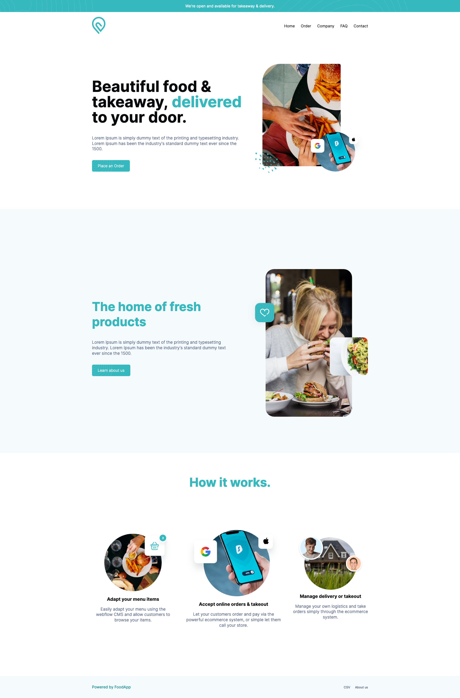

# FoodApp

## Spécifications

Afin de faciliter le travail, forket ce dépôt sur votre Git.

#### Couleurs

```css
:root {
    --white: #ffffff;
    --gray-light: #f5fbfc;
    --gray-dark: #08090a;
    --green: #35b8be;
    --green-dark: #1b9097;
    --green-light: #f5fbfc;
    --blue-dark: #546285;
}
```

#### Police de caractères

```
Inter en 300, 400, 600 et 700
```

Privilégier l'anglais pour le nom de vos classes CSS

## Preview



